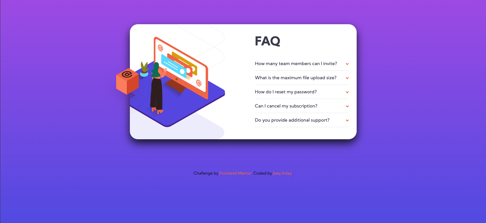

# Frontend Mentor - FAQ accordion card solution

This is a solution to the [FAQ accordion card challenge on Frontend Mentor](https://www.frontendmentor.io/challenges/faq-accordion-card-XlyjD0Oam). Frontend Mentor challenges help you improve your coding skills by building realistic projects.

## Table of contents

- [Overview](#overview)
  - [The challenge](#the-challenge)
  - [Screenshot](#screenshot)
  - [Links](#links)
- [My process](#my-process)
  - [Built with](#built-with)
  - [Continued development](#continued-development)
- [Author](#author)
- [Acknowledgments](#acknowledgments)

## Overview

### The challenge

Users should be able to:

- View the optimal layout for the component depending on their device's screen size
- See hover states for all interactive elements on the page
- Hide/Show the answer to a question when the question is clicked

### Screenshot



### Links

- Solution URL: [https://www.frontendmentor.io/solutions/mobilefirst-faq-accordion-card-with-sass-fEUro54g2](https://www.frontendmentor.io/solutions/mobilefirst-faq-accordion-card-with-sass-fEUro54g2)
- Live Site URL: [https://dentednerd.github.io/fm-accordion-sass/](https://dentednerd.github.io/fm-accordion-sass/)

## My process

### Built with

- Semantic HTML5 markup
- Sass
- Flexbox
- Mobile-first workflow

Kept the Javascript minimal:

```js
function onClick() {
  var thisItem = event.target.parentNode;
  thisItem.classList.toggle("open");
};
```

Used CSS variables:

```css
:root {
  --text-primary-blue: hsl(238, 29%, 16%);
  --text-primary-red: hsl(14, 88%, 65%);
  --text-neutral-vdark: hsl(237, 12%, 33%);
  --text-neutral-dark: hsl(240, 6%, 50%);
  --bg-violet: hsl(273, 75%, 66%);
  --bg-blue: hsl(240, 73%, 65%);
  --divider-blue: hsl(240, 5%, 91%);
}
```

Each answer animates into view:

```css
.answer {
  height: 0;
  transform: scaleY(0);
  transform-origin: center top;
}

&.open {
  .answer {
    height: auto;
    transform: scaleY(1);
    transform-origin: center top;
    transition: transform 0.2s ease-in-out;
  }
}

```

The arrow on each item flips:

```css
button.question {
  &::after {
    content: '';
    background-image: url('../images/icon-arrow-down.svg');
    transform: scaleY(1);
    transition: transform 0.2s ease-in-out;
  }
}

&.open {
  button.question {
    &::after {
      transform: scaleY(-1);
      transition: transform 0.2s ease-in-out;
    }
  }
}
```

Made use of the [Live Server](https://marketplace.visualstudio.com/items?itemName=ritwickdey.LiveServer) and [Live Sass Compiler](https://marketplace.visualstudio.com/items?itemName=ritwickdey.live-sass) extensions for VSCode in development.

### Continued development

I'd like to rebuild this in React, with styled-components.

## Author

- Website - [Joey Imlay](https://joeyimlay.dev)
- Frontend Mentor - [@dentednerd](https://www.frontendmentor.io/profile/dentednerd)
- Twitter - [@dentednerd](https://www.twitter.com/dentednerd)

## Acknowledgments

I was inspired to pick this up by [Coder Coder](https://www.youtube.com/watch?v=FboXxLxg8eo).
